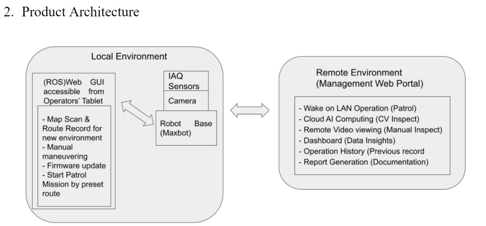

# ROS Project for Internship
ROS project I am working on for internship. Using Ros-Noetic with Docker, have docker container for both Nvidia and integrated GPU. Currently mainly working on webpage GUI.



## Running Docker for ROS
Build docker image with `docker build -t tagname .` and then run bash script. For example for Nvidia Ros container run: 
```
docker build -t nvidia_ros_noetic .
chmod +x nvidia_ros.bash
./nvidia_ros.bash
```
Docker containers have GUI support using first method from wiki: http://wiki.ros.org/docker/Tutorials/GUI. Modify bash script or Dockerfile to add volumes, remove GUI, or other configurations.

## Done so far
- Able to connect to Rosbridge and use roslibjs
- Able to control robot through virtual joystick
- Able to stream camera both from HTTP stream and ROS camera publisher

## Todo:
- Display point cloud messages
- Create nice UI (dashboard like)
